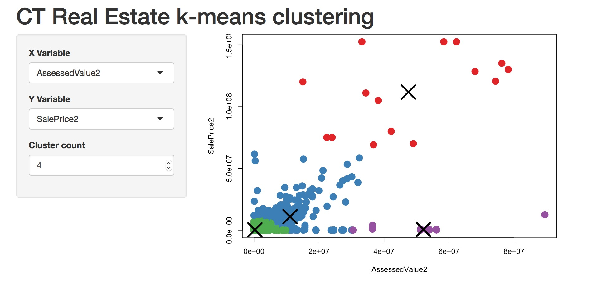

_____________________________

Go to Section:                 
1. [Data Source](#data-source) 
2. [EDA](#eda)
3. [Data Cleaning](#data-cleaning)
4. [Feature Engineering](#feature-engineering)
5. [Modeling](#modeling)    
6. [Shiny App Link](#shiny-application)

_____________________________

### Data Source

<https://data.ct.gov/Housing-and-Development/Real-Estate-Sales-By-Town-for-2011-2012-2013/8udc-aepg>

_Summary:_ The Office of Policy and Management maintains a listing of all real estate sales with a sales price of $2,000 or greater that occur between October 1 and September 30 of each year. For each sale record, the file includes: town, property address, date of sale, property type (residential, apartment, commercial, industrial or vacant land), sales price, and property assessment.
```{r}
library(RSocrata)
url = "https://data.ct.gov/Housing-and-Development/Real-Estate-Sales-By-Town-for-2011-2012-2013/8udc-aepg"
real_estate <- read.socrata(url)
save(real_estate, file = "real_estate.RData")
str(real_estate)
```

### Data Cleaning
```{r}
# remove $ punctuation
real_estate$AssessedValue <- gsub("^[[:punct:]]", "", real_estate$AssessedValue)
real_estate$SalePrice <- gsub("^[[:punct:]]", "", real_estate$SalePrice)
# change columns AssessedValue and SalePrice from chr to numeric
real_estate$AssessedValue2 <- as.numeric(real_estate$AssessedValue)
real_estate$SalePrice2 <- as.numeric(real_estate$SalePrice)
```

### EDA

```{r}
# summary numbers of reponse
summary(real_estate$SalePrice2)

# correlations
cor(real_estate$SalePrice2, real_estate$AssessedValue2) # moderate-high value

# scatterplot 
b_real_estate <- real_estate[, - 3] # create background data for plot

library(ggplot2)
library(plotly)
s <- ggplot(real_estate, aes(x = AssessedValue2, y = SalePrice2, fill=factor(ListYear))) + 
            geom_point(data=b_real_estate, fill = "grey", alpha=0.3) +
            geom_point() +
            facet_wrap(~ ListYear) +
            theme_bw() +
            labs(title = "Real Estate Prices by Listing Year", 
                 x = "Assesed Value ($)", y = "Sale Price ($)") +
            guides(fill = FALSE)
s # observable positive correlation
ggplotly(s)
# histogram of response prediction
h <- ggplot(real_estate, aes(x=SalePrice2)) +
            geom_histogram(bins = 1000) +
            theme_bw() +
            labs(title = "Histogram of Sale Price, Response", 
                 x = "Sale Price ($)", y="")
  
h  
  


```

### Feature Engineering

* Add and aggreagte counties instead of using individual towns
* possibly aggregate towns by population size
* explore other variables to enhance the original set

```{r}
# create our new column
real_estate$county <- NA

fairfield <- c("Bethel","Bridgeport","Brookfield","Danbury","Darien",
"Easton","Fairfield","Greenwich","Monroe","New Canaan","New Fairfield",
"Newtown","Norwalk","Redding","Ridgefield","Shelton","Sherman","Stamford",
"Stratford","Trumbull","Weston","Westport","Wilton")

real_estate$county[which(real_estate$Name %in% fairfield)] <- "Fairfield"

hartford <- c("Avon","Berlin","Bloomfield","Bristol","Burlington",
"Canton","East Granby","East Hartford","East Windsor","Enfield",
"Farmington","Glastonbury","Granby","Hartford","Hartland",
"Manchester","Marlborough","New Britain","Newington","Plainville",
"Rocky Hill","Simsbury","South Windsor","Southington","Suffield",
"West Hartford","Wethersfield","Windsor","Windsor Locks")

real_estate$county[which(real_estate$Name %in% hartford)] <- "Hartford"

litchfield <- c("Barkhamsted","Bethlehem","Bridgewater","Canaan",
"Colebrook","Cornwall","Goshen","Harwinton","Kent","Litchfield",
"Morris","New Hartford","New Milford","Norfolk","North Canaan",
"Plymouth","Roxbury","Salisbury","Sharon","Thomaston","Torrington","Warren",
"Washington","Watertown","Winchester","Woodbury")

real_estate$county[which(real_estate$Name %in% litchfield)] <- "Litchfield"

middlesex <- c("Chester","Clinton","Cromwell","Deep River",
"Durham","East Haddam","East Hampton","Essex","Haddam",
"Killingworth","Middlefield","Middletown","Old Saybrook","Portland","Westbrook")

real_estate$county[which(real_estate$Name %in% middlesex)] <- "Middlesex"

newhaven <- c("Ansonia","Beacon Falls","Bethany","Branford",
"Cheshire","Derby","East Haven","Guilford","Hamden","Madison","Meriden",
"Middlebury","Milford","Naugatuck","New Haven","North Branford",
"North Haven","Orange","Oxford","Prospect","Seymour","Southbury",
"Wallingford","Waterbury","West Haven","Wolcott","Woodbridge")

real_estate$county[which(real_estate$Name %in% newhaven)] <- "New Haven"

newlondon <- c("Bozrah", "Colchester","East Lyme","Franklin",
"Griswold","Groton","Lebanon","Ledyard","Lisbon","Lyme",
"Montville","New London","North Stonington","Norwich",
"Old Lyme","Preston","Salem","Sprague","Stonington","Voluntown","Waterford")

real_estate$county[which(real_estate$Name %in% newlondon)] <- "New London"

tolland <- c("Andover","Bolton","Columbia","Coventry","Ellington",
"Hebron","Mansfield","Somers","Stafford","Tolland",
"Union","Vernon","Willington")

real_estate$county[which(real_estate$Name %in% tolland)] <- "Tolland"

windham <- c("Ashford","Brooklyn","Canterbury","Chaplin","Eastford",
"Hampton","Killingly","Plainfield","Pomfret","Putnam","Scotland",
"Sterling","Thompson","Windham","Woodstock")

real_estate$county[which(real_estate$Name %in% windham)] <- "Windham"

```


### Modeling              

It is favorable to see a moderately high correlation between the independent and dependent variable of interest. My assumption is that the assessed value will be a good predictor of sale price within this data-set. There is also an assumption that towns, `Name` variable will have a great indication of assessed & sale price which is due to the varying amounts of affluence in Connecticut. A seen in the `fit` model some of the _significant_ `Name` dummy variables are some of the most wealthy towns in [Connecticut](https://en.wikipedia.org/wiki/List_of_Connecticut_locations_by_per_capita_income) and the [US](http://time.com/100987/richest-towns/) - So its not specifically associated with town name but with the makeup of the town residents (and assets) that really affect real estate prices in Connecticut. This also goes to underscore the housing market and its revival from the recent recession.

```{r}
# Initial Linear Model 
fit = lm(SalePrice2 ~ AssessedValue2 + county, data = real_estate)
summary(fit) # low p-values for the overall model and coeffcients
# the model could definelty be improved with other factors not in this data-set
```


### Shiny application

Data Mining is the extraction of interesting (non-trivial, implicit, hidden, previously unknown, and potentially useful) patterns from huge amounts of data. Pattern Discovery is a functional step in the KDD process which includes Supervised Learning and Unsupervised Learning. Supervised Learning is when the labels about the independent response variable are known in a training data-set. Prediction is when the labels are continuous, such as the SalePrice of real estate. Unsupervised Learning means that the labels are unknown and it is the goal to cluster values by commonalities in means. **Clustering** is a learning technique where the goal is to find hidden groups in the data.

Code Available at: [https://github.com/jasdumas/regression/blob/master/ct-realestate/ct-realestate-shiny-app.Rmd](https://github.com/jasdumas/regression/blob/master/ct-realestate/ct-realestate-shiny-app.Rmd)



